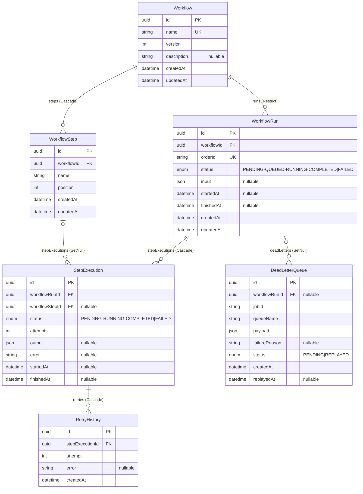
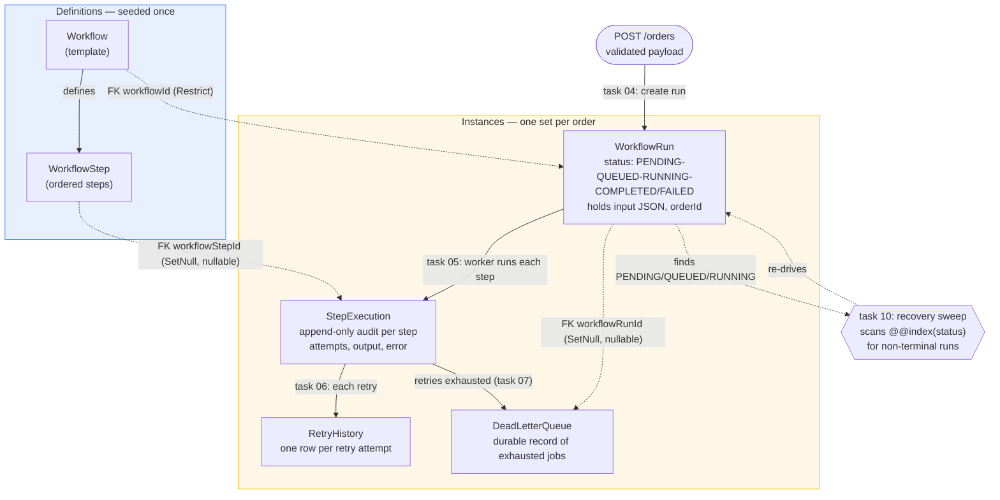

# Database Schema — Distributed Workflow Orchestration Platform

> **Keep this in sync.** This document is the human-readable view of
> [`prisma/schema.prisma`](../prisma/schema.prisma). Whenever the schema changes
> (models, fields, relations, enums, indexes, or delete behavior), update the
> diagrams and notes below in the same change. A hook reminds you on edit, but
> the regeneration is manual — the dataflow diagram and commentary are hand-authored.

The schema splits into two halves:

- **Definitions (seeded, few rows):** `Workflow` → `WorkflowStep`. The template —
  e.g. `order-processing` and its ordered steps.
- **Instances (per order, high cardinality):** `WorkflowRun` → `StepExecution` →
  `RetryHistory`, plus `DeadLetterQueue`. One set created per order.

## 1. Entity-Relationship Diagram (structure)

## 2. Dataflow Diagram (how an order moves through it)

Each table mapped to the lifecycle stage and the task that writes it.

## 3. Design notes the diagrams reveal

- **Delete behavior encodes intent.** Definitions can't be deleted while runs
  exist (`Restrict` on `WorkflowRun → Workflow`), protecting audit history. Audit
  records *survive* definition changes: `StepExecution.workflowStepId` and
  `DeadLetterQueue.workflowRunId` are nullable + `SetNull`, so they outlive the
  rows they point at. Within a run, everything cascades (delete a run → its
  executions and retries go too).
- **`orderId` is the external handle.** It's `@unique` on `WorkflowRun` so
  `GET /orders/:id` can find a run by business order id, while `id` (uuidv7) is the
  internal key.
- **Status enums + indexes drive recovery.** Both `WorkflowRun.status` and
  `StepExecution.status` are indexed so task 10's crash-recovery sweep can cheaply
  find non-terminal (stuck) work.
- **The DLQ is deliberately decoupled.** It keeps `jobId` / `queueName` / `payload`
  so a dead-lettered job is replayable even if its originating run row is gone.

## 4. Enums (lifecycle state machines)

| Enum | Values | Written by |
| --- | --- | --- |
| `WorkflowRunStatus` | `PENDING → QUEUED → RUNNING → COMPLETED \| FAILED` | tasks 04/07/10 |
| `StepExecutionStatus` | `PENDING → RUNNING → COMPLETED \| FAILED` | task 05 |
| `DeadLetterStatus` | `PENDING \| REPLAYED` | task 07 |

_Task 09 will extend the run and step enums with `COMPENSATED`._
